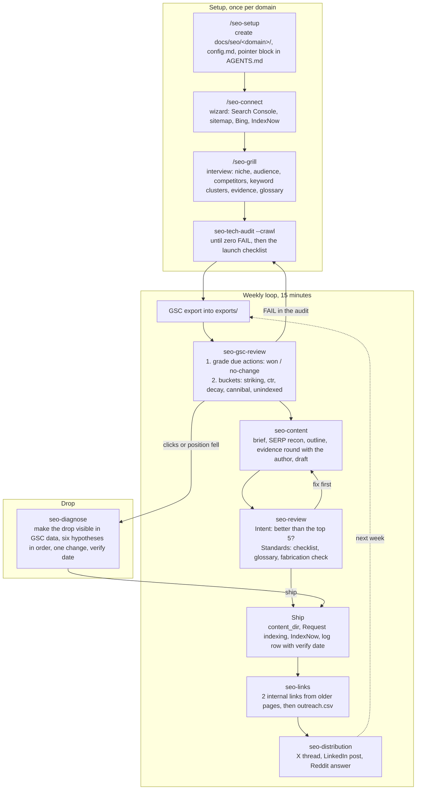

# Curated skill collection

Private, hand-maintained skills for recurring work. Skills live under `skills/<theme>/<skill>/`. Each skill is a directory with `SKILL.md`, and optionally `references/` (knowledge loaded only when needed), `scripts/` (deterministic helpers, Python stdlib or bash only), `templates/` (files a skill writes into a project), and `agents/openai.yaml` (Codex metadata).

## Structure

- One user-invoked router per theme (for example `/seo`) names the sub-skills, the flows, and the priorities. No context cost until it is called.
- User-invoked skills (`disable-model-invocation: true` plus `policy.allow_implicit_invocation: false` in `agents/openai.yaml`) orchestrate; model-invoked skills with a sharp `description` (one trigger per branch) hold the reusable discipline. Steps end on a completion criterion; reference material sits behind pointers.
- No tool marketing in steps: tools appear only in `references/tools.md` and are interchangeable.
- State lives in the project, not in the skill: the SEO skills read and write `docs/seo/<domain>/` in the site's repository (config, strategy, glossary, weekly log, briefs, drafts, exports). `docs/seo/README.md`, written by `seo-setup`, documents the layout and the log format.

## The SEO loop, start to end

Three phases. Setup once per domain, the weekly loop for good, diagnosis only when something drops. Everything that changes the site leaves a row in the log; the loop learns from the log, not from memory.



### What each skill delivers

| Step | Skill | Output | Why here |
|---|---|---|---|
| Set up | `seo-setup` | `docs/seo/<domain>/` with `config.md`, log, briefs, drafts, exports, audits; pointer block in `AGENTS.md` and `CLAUDE.md` | Every later run starts warm: brand regex, CTR calibration, template paths are fixed. Several domains are several folders. |
| Connect | `seo-connect` | `connect.sh`, a wizard that walks the human through the clicks and fills `connections.md` | Only a human can create the property, submit the sitemap, import into Bing, and place the IndexNow key. The wizard checks what it can check itself (sitemap 200, key file, IndexNow response). |
| Understand | `seo-grill` | `strategy.md` (offer, audience, competitors, keyword clusters with priority, evidence inventory, constraints) and `glossary.md` | Facts are the agent's job (SERPs, export); decisions are the user's. Without an evidence inventory, drafts stay empty placeholders. |
| Check | `seo-tech-audit` | Report with a fix per check id, applied in the template or written as CMS admin steps with the new value, full JSON in `audits/`, `tech` row in the log | Nothing counts before the pages are indexable. |
| Pick | `seo-gsc-review` | First the verdict on due actions from earlier weeks, then one table: URL, query, action, expected gain; every accepted row goes to the log | Position 8–20 is closer to page 1 than any new article. Verdicts first, so the same action is never recommended twice. |
| Write | `seo-content` | `briefs/<slug>.md`, `drafts/<slug>.md` with evidence slots, one round of questions to the author, on-page checklist | One page, one intent. What the author has not confirmed stays a slot and never becomes a sentence. |
| Approve | `seo-review` | Two separate reports, each with a verdict: `ship` or `fix first` | A page can be right for the query and still unbacked, or the reverse. Separate axes cannot hide each other. |
| Link | `seo-links` | Internal links first, then `outreach.csv` with a reason per target, emails, status | Internal links cost nothing and work immediately. Paid links carry `rel="sponsored"`. |
| Distribute | `seo-distribution` | Three texts, keyword in line one, the link where it completes the answer | Reach and referral traffic, not ranking credit: Reddit and LinkedIn set `nofollow`. |
| Repair | `seo-diagnose` | The red line from the export, ranked hypotheses with predictions, one change, `diagnose` row in the log | Data first, theory second. Two changes in one verify window make the outcome unreadable. |

### The log

`docs/seo/<domain>/log/2026-W36.md`, one file per week. Every action has an id, a bucket, a status (`todo`, `applied`, `verify`, `won`, `no-change`, `dropped`), and a verify date: 14 days for title and meta, 28 days for content, links, and diagnosis. `scaffold.py <domain> --due` lists what is due; `seo-gsc-review` records the verdict. After a few weeks the log says which actions work on this site and which do not.

## Skills

Theme `skills/seo/`. You call user-invoked skills yourself (`/name` in Claude Code, `$name` in Codex); the agent reaches for model-invoked skills when the task fits.

| Skill | Invoked by | Deterministic part |
|---|---|---|
| `seo` | user | Router: workspace, three flows, priority ladder, launch checklist, domain naming, tool stack, `references/sources.md` |
| `seo-setup` | user | `scripts/scaffold.py`: create folders, `--log` (log path and next id), `--due` (actions due), `--check` |
| `seo-connect` | user | `templates/wizard.sh`: wizard library; `references/stages.md`: verified click paths |
| `seo-grill` | user | `references/question-bank.md`: the question tree |
| `seo-tech-audit` | model | `scripts/audit.py URL --crawl N` |
| `seo-gsc-review` | model | `scripts/gsc_opportunities.py EXPORT --previous EXPORT` (tests: `scripts/test_gsc.py`) |
| `seo-content` | model | `references/page-types.md`, `references/on-page-checklist.md` |
| `seo-review` | model | two subagent briefs with a fixed word limit |
| `seo-diagnose` | model | `references/hypotheses.md`: six hypotheses with prediction, check, fix |
| `seo-links` | model | `references/link-quality.md`, `references/outreach-templates.md` |
| `seo-distribution` | model | `references/formats.md` |

## Use in a project

Claude Code reads `<repo>/.claude/skills/`, Codex reads `<repo>/.agents/skills/`. One script links into both:

```bash
scripts/link.sh <repo>            # every skill
scripts/link.sh <repo> seo        # one theme (skills/seo/*)
scripts/link.sh <repo> seo-setup  # named skills, globs allowed
```

Then run `/seo-setup` (Claude Code) or `$seo-setup` (Codex) in the repo. When a skill is stable: move it to `~/Developer/claude-skill-library/skills/` and distribute it with `link.sh` from `project-index`.

## Maintenance

- Test scripts before editing the SKILL.md that calls them: `python3 skills/seo/seo-tech-audit/scripts/test_audit.py` (offline) and `python3 skills/seo/seo-tech-audit/scripts/audit.py https://example.com`, `python3 skills/seo/seo-gsc-review/scripts/test_gsc.py` (offline), `python3 skills/seo/seo-gsc-review/scripts/gsc_opportunities.py --help`, `python3 skills/seo/seo-setup/scripts/scaffold.py --root /tmp/x example.com`, `bash -n skills/seo/seo-connect/templates/wizard.sh`.
- Every line in a SKILL.md must change behaviour; what the model does anyway goes.
- The router must not lie: whoever adds, renames, or changes a sub-skill checks `skills/seo/seo/SKILL.md` and the table above in the same commit.
- Years, tool names, platform behaviour, and Google features live only in `references/`; every such claim has a row in `skills/seo/seo/references/sources.md` with URL and check date. Unverified means: labelled as a heuristic, or removed.
